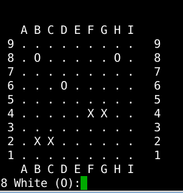

# PerlGo

This repository contains a little programm I wrote in Perl more than a decade ago: PerlGo.

It allows you to play against another human player on the console, with a simple ASCII board representation

You can also configure it to use POV-Ray to render the game board and create the tga images necessary for stitching together a simple video.

 Copyright Ingo Wiarda 2003

# Contact

ingo_wiarda@dewarim.de